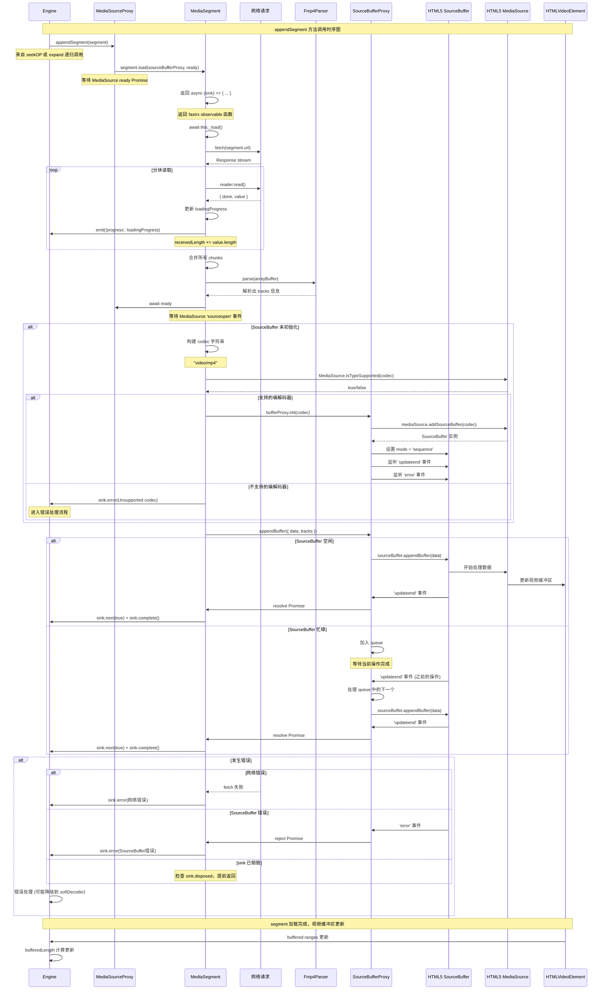

```mermaid
sequenceDiagram
    participant Engine as Engine
    participant MediaSourceProxy as MediaSourceProxy
    participant MediaSegment as MediaSegment
    participant Network as 网络请求
    participant Fmp4Parser as Fmp4Parser
    participant SourceBufferProxy as SourceBufferProxy
    participant SourceBuffer as HTML5 SourceBuffer
    participant MediaSource as HTML5 MediaSource
    participant Video as HTMLVideoElement

    Note over Engine, Video: appendSegment 方法调用时序图

    %% 1. 引擎调用 appendSegment
    Engine->>MediaSourceProxy: appendSegment(segment)
    Note over Engine: 来自 seekOP 或 expand 递归调用

    %% 2. MediaSourceProxy 转发到 MediaSegment
    MediaSourceProxy->>MediaSegment: segment.load(sourceBufferProxy, ready)
    Note over MediaSourceProxy: 等待 MediaSource ready Promise

    %% 3. MediaSegment 开始异步加载
    MediaSegment->>MediaSegment: 返回 async (sink) => { ... }
    Note over MediaSegment: 返回 fastrx observable 函数

    %% 4. 数据获取阶段
    MediaSegment->>MediaSegment: await this._load()
    MediaSegment->>Network: fetch(segment.url)
    Network-->>MediaSegment: Response stream

    %% 5. 流式读取数据
    loop 分块读取
        MediaSegment->>Network: reader.read()
        Network-->>MediaSegment: { done, value }
        MediaSegment->>MediaSegment: 更新 loadingProgress
        MediaSegment->>Engine: emit('progress', loadingProgress)
        Note over MediaSegment: receivedLength += value.length
    end

    MediaSegment->>MediaSegment: 合并所有 chunks
    MediaSegment->>Fmp4Parser: parse(arrayBuffer)
    Fmp4Parser-->>MediaSegment: 解析出 tracks 信息

    %% 6. 等待 MediaSource 就绪
    MediaSegment->>MediaSourceProxy: await ready
    Note over MediaSegment: 等待 MediaSource 'sourceopen' 事件

    %% 7. 检查并初始化 SourceBuffer
    alt SourceBuffer 未初始化
        MediaSegment->>MediaSegment: 构建 codec 字符串
        Note over MediaSegment: "video/mp4" 
        MediaSegment->>MediaSource: MediaSource.isTypeSupported(codec)
        MediaSource-->>MediaSegment: true/false
        
        alt 支持的编解码器
            MediaSegment->>SourceBufferProxy: bufferProxy.init(codec)
            SourceBufferProxy->>MediaSource: mediaSource.addSourceBuffer(codec)
            MediaSource-->>SourceBufferProxy: SourceBuffer 实例
            SourceBufferProxy->>SourceBuffer: 设置 mode = 'sequence'
            SourceBufferProxy->>SourceBuffer: 监听 'updateend' 事件
            SourceBufferProxy->>SourceBuffer: 监听 'error' 事件
        else 不支持的编解码器
            MediaSegment->>Engine: sink.error(Unsupported codec)
            Note over Engine: 进入错误处理流程
        end
    end

    %% 8. 添加数据到缓冲区
    MediaSegment->>SourceBufferProxy: appendBuffer({ data, tracks })
    
    alt SourceBuffer 空闲
        SourceBufferProxy->>SourceBuffer: sourceBuffer.appendBuffer(data)
        SourceBuffer->>MediaSource: 开始处理数据
        MediaSource->>Video: 更新视频缓冲区
        
        %% 9. 异步完成
        SourceBuffer->>SourceBufferProxy: 'updateend' 事件
        SourceBufferProxy->>MediaSegment: resolve Promise
        MediaSegment->>Engine: sink.next(true) + sink.complete()
        
    else SourceBuffer 忙碌
        SourceBufferProxy->>SourceBufferProxy: 加入 queue
        Note over SourceBufferProxy: 等待当前操作完成
        
        %% 队列处理
        SourceBuffer->>SourceBufferProxy: 'updateend' 事件 (之前的操作)
        SourceBufferProxy->>SourceBufferProxy: 处理 queue 中的下一个
        SourceBufferProxy->>SourceBuffer: sourceBuffer.appendBuffer(data)
        SourceBuffer->>SourceBufferProxy: 'updateend' 事件
        SourceBufferProxy->>MediaSegment: resolve Promise
        MediaSegment->>Engine: sink.next(true) + sink.complete()
    end

    %% 10. 错误处理
    alt 发生错误
        alt 网络错误
            Network-->>MediaSegment: fetch 失败
            MediaSegment->>Engine: sink.error(网络错误)
        else SourceBuffer 错误
            SourceBuffer->>SourceBufferProxy: 'error' 事件
            SourceBufferProxy->>MediaSegment: reject Promise
            MediaSegment->>Engine: sink.error(SourceBuffer错误)
        else sink 已销毁
            Note over MediaSegment: 检查 sink.disposed，提前返回
        end
        Engine->>Engine: 错误处理 (可能降级到 softDecoder)
    end

    %% 11. 最终结果
    Note over Engine, Video: segment 加载完成，视频缓冲区更新
    Video->>Engine: buffered ranges 更新
    Engine->>Engine: bufferedLength 计算更新
```
