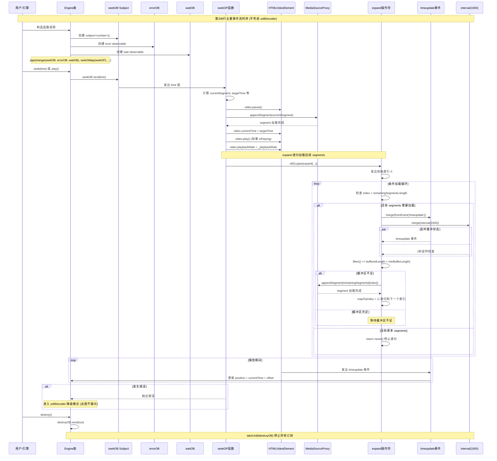

```mermaid
sequenceDiagram
    participant User as 用户/引擎
    participant Engine as Engine类
    participant SeekOB as seekOB Subject
    participant ErrorOB as errorOB
    participant WaitOB as waitOB
    participant SeekOP as seekOP函数
    participant Video as HTMLVideoElement
    participant MediaSource as MediaSourceProxy
    participant Expand as expand操作符
    participant TimeUpdate as timeupdate事件
    participant Interval as interval(1000)

    Note over User, Interval: 第208行主要事件流时序 (不考虑 softDecoder)

    %% 1. 初始化阶段
    User->>Engine: 构造函数调用
    Engine->>SeekOB: 创建 subject<number>()
    Engine->>ErrorOB: 创建 error observable
    Engine->>WaitOB: 创建 wait observable
    
    %% 2. 主要订阅开始 (第208行)
    Note over Engine: pipe(merge(seekOB, errorOB, waitOB), switchMap(seekOP), ...)
    
    %% 3. 用户触发 seek
    User->>Engine: seek(time) 或 play()
    Engine->>SeekOB: seekOB.next(time)
    
    %% 4. seekOP 函数执行
    SeekOB->>SeekOP: 发出 time 值
    SeekOP->>SeekOP: 计算 currentSegment, targetTime 等
    SeekOP->>Video: video.pause()
    
    %% 5. 加载当前 segment
    SeekOP->>MediaSource: appendSegment(currentSegment)
    MediaSource-->>SeekOP: segment 加载完成
    
    %% 6. 设置视频状态
    SeekOP->>Video: video.currentTime = targetTime
    SeekOP->>Video: video.play() (如果 isPlaying)
    SeekOP->>Video: video.playbackRate = _playbackRate
    
    %% 7. 启动 expand 条件加载序列
    Note over SeekOP, Expand: expand 递归加载后续 segments
    SeekOP->>Expand: of(0).pipe(expand(...))
    Expand->>Expand: 发出初始索引 0
    
    %% 8. expand 函数循环
    loop 条件加载循环
        Expand->>Expand: 检查 index < remainingSegments.length
        
        alt 还有 segments 需要加载
            Expand->>TimeUpdate: merge(fromEvent('timeupdate'))
            Expand->>Interval: merge(interval(1000))
            
            par 监听缓冲状态
                TimeUpdate-->>Expand: timeupdate 事件
            and
                Interval-->>Expand: 1秒定时检查
            end
            
            Expand->>Expand: filter(() => bufferedLength < minBufferLength)
            
            alt 缓冲区不足
                Expand->>MediaSource: appendSegment(remainingSegments[index])
                MediaSource-->>Expand: segment 加载完成
                Expand->>Expand: mapTo(index + 1) 递归到下一个索引
            else 缓冲区充足
                Note over Expand: 等待缓冲区不足
            end
            
        else 没有更多 segments
            Expand->>Expand: return never() 停止递归
        end
    end
    
    %% 9. 持续的位置更新
    loop 播放期间
        Video->>TimeUpdate: 发出 timeupdate 事件
        TimeUpdate->>Engine: 更新 position = currentTime + offset
    end
    
    %% 10. 错误处理 (在 subscribe 的 error 回调中)
    alt 发生错误
        SeekOP-->>Engine: 抛出错误
        Note over Engine: 进入 softDecoder 降级模式 (此图不展示)
    end
    
    %% 11. 销毁时清理
    User->>Engine: destroy()
    Engine->>Engine: destroyOB.next(true)
    Note over Engine, Interval: takeUntil(destroyOB) 停止所有订阅
```
